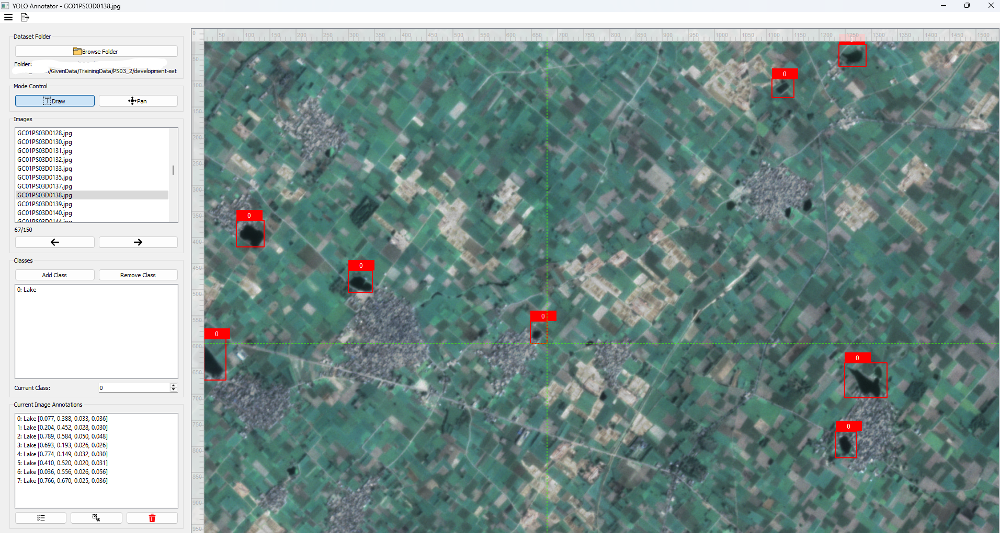

# LabelSense
LabelSense is a user-friendly desktop application for image annotation, specifically designed to help you create **YOLO (You Only Look Once)** datasets. Built with PyQt5, it provides a simple GUI for drawing bounding boxes, assigning classes, and exporting your data in the correct format for training YOLO models. This is the initial release of the software.



## Features

  * **YOLO Format Support**: Exports annotations in the standard YOLO format (.txt files) for seamless model training.
  * **Intuitive GUI**: Navigate and annotate with ease using the clean interface.
  * **Class Management**: Add, remove, and manage your custom classes for each annotation project.
  * **Dataset Export**: Automatically splits your dataset into `train` and `val` directories and generates a `data.yaml` configuration file, ready for immediate use with YOLO training scripts.
  * **Bounding Box Tools**:
      * **Draw Mode**: Create new bounding boxes with a simple click-and-drag.
      * **Edit Mode**: Select, move, and resize existing annotations for precise adjustments.
      * **Pan Mode**: Move around large images with a dedicated panning tool.
  * **Zoom Functionality**: Zoom in and out to make precise annotations on detailed images.
  * **Project Saving**: Save your annotation progress to a project file and resume your work at any time.

## Requirements

To run LabelSense, you need **Python** installed on your system. The required Python libraries are listed in `requirements.txt`.

```
PyQt5==5.15.11
PyQt5-Qt5==5.15.17
PyQt5_sip==12.17.0
PyYAML==6.0.2
```

-----

## Getting Started

### Installation

1.  **Clone the repository**
2.  **Create a Python virtual environment**
3.  **Install dependencies**:

    ```bash
    pip install -r requirements.txt
    ```

### Usage

1.  **Run the application**:

    ```bash
    python main.py
    ```

2.  **Load Images**: Click the **"Browse Folder"** button to select the directory containing your images.

3.  **Annotate**:

      * Select or add your desired classes.
      * Use the **"Draw"** tool to create bounding boxes on the images.
      * Switch to **"Edit"** mode to modify existing boxes or **"Pan"** to navigate the image.

4.  **Save and Export**:

      * Use **File \> Save** to save your current annotation progress.
      * Once you're done, go to **Export \> Export YOLO Dataset** to generate your dataset. A dialog will prompt you to choose the training/validation split percentage and the output directory.

-----

## Project Structure

```
.
├── .venv/                  # Virtual environment
├── requirements.txt        # Python dependencies
├── README.md               # This file
└── src/
    ├── main.py             # Main entry point to run the application
    └── utils/
        ├── LabelSense.py   # Main application logic
        └── image_canvas.py # Handles image display and annotation drawing
```

-----

## Contribution

This is the first version of LabelSense. Your feedback and contributions are welcome\! If you find a bug, have a feature request, or want to contribute code, please open an issue or a pull request on GitHub.

## License
[MIT License](LICENSE)

-----

**© LabelSense Annotator 2025**
Developed by Rahim Biswas
